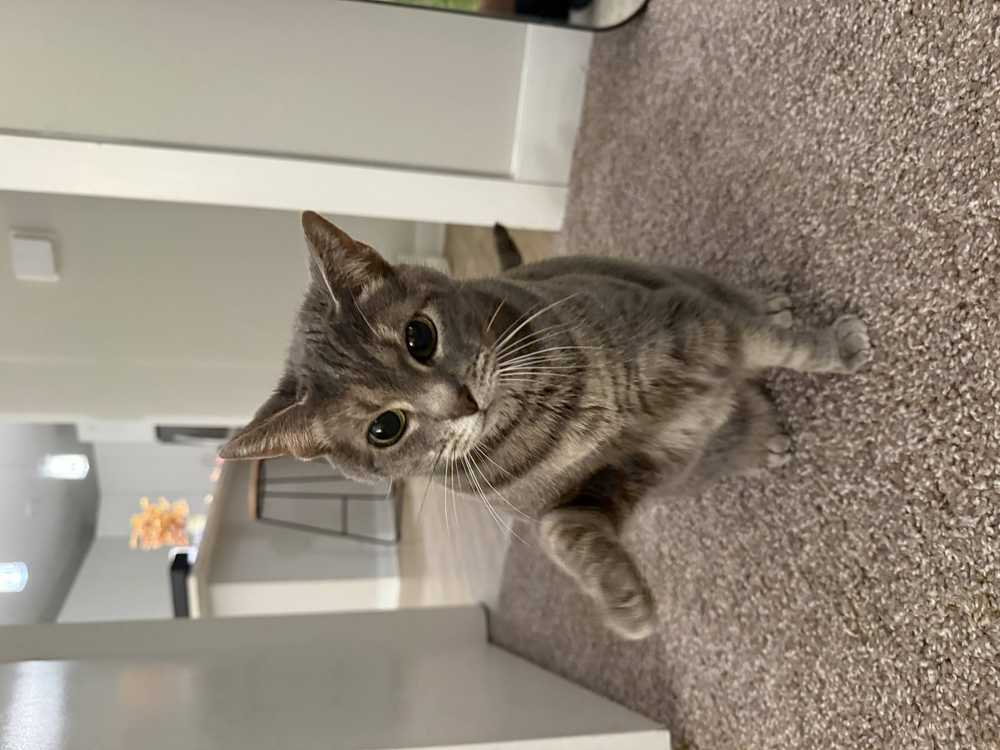

This week I spent a bunch of days trying to make a good carbonara. I finally figured it out:

1. Put pancetta in a cold pan at medium heat (this is so the fat renders out and we get a nice amount of flavorful oil for our sauce)
2. At the SAME time, put water in a pot to boil
3. Grind some black peppercorns
4. Wisk 3 eggs together with a nice amount of grated parmesan cheese (Jaime Oliver says a "heart attack" amount)
5. Once the water is boiling, add the pasta and a PINCH of salt (the pancetta is salty so we don't need much salt)
6. At the same time, take the pancetta off the heat (it should be somewhat cooked, not crispy)
7. Once the pasta is al dente, take tongs and grab the pasta from the pot and transfer it to the pancetta pan (we want it to be wet, not dry)
8. Add our ground peppercorn and toss the pasta in our pancetta oil pasta water mixture
9. Add our wisked eggs and parmesan cheese and vigoursly mix the pasta around with the newly forming sauce (it's important to move it around quickly so the eggs don't curdle and become scrambled eggs but we make a sauce with the heat of our pasta and pancetta)
10. Once creamy and smelling good, plate the newly formed carbonara, grate some more parmesan cheese on top, and eat while watching the newest episode of Frieren
11. Wash your dishes

I wish I had a picture of my carbonara attempts but I don't so here is my cat:

