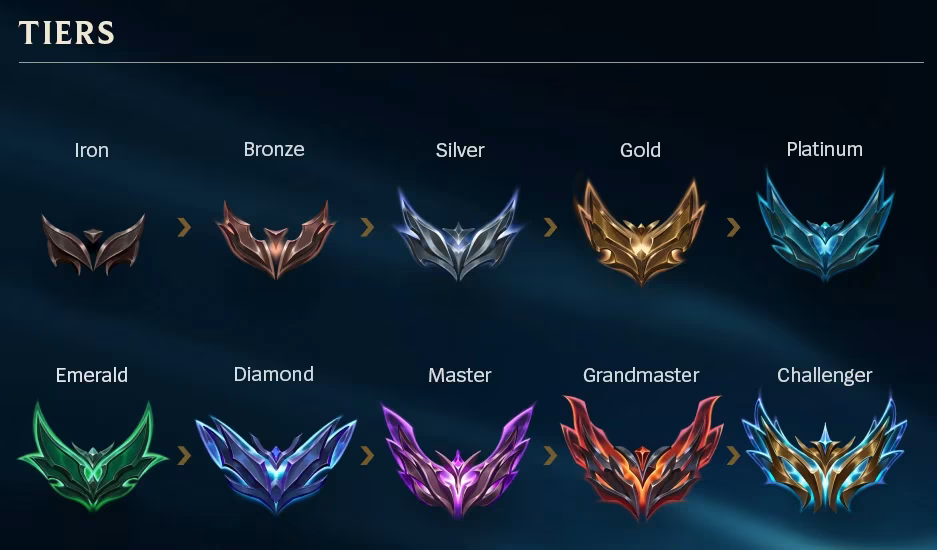
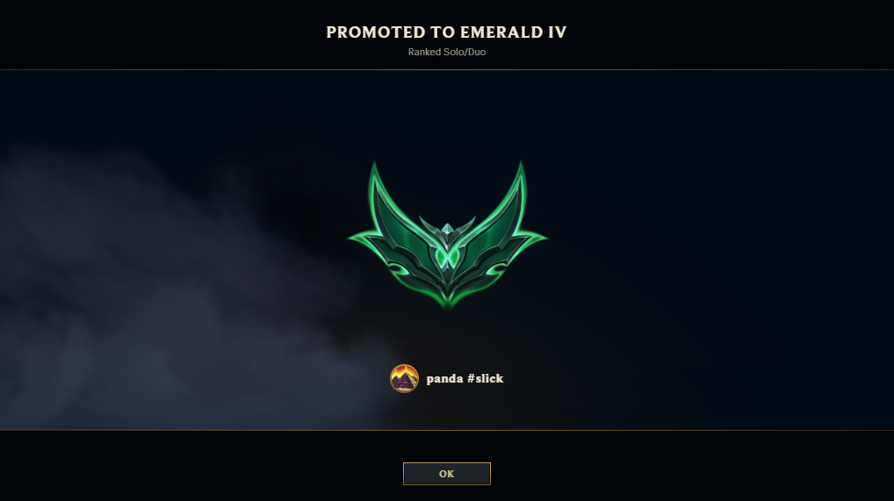
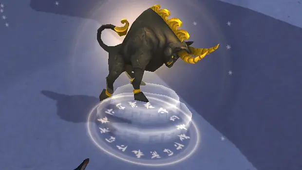
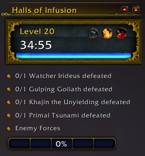
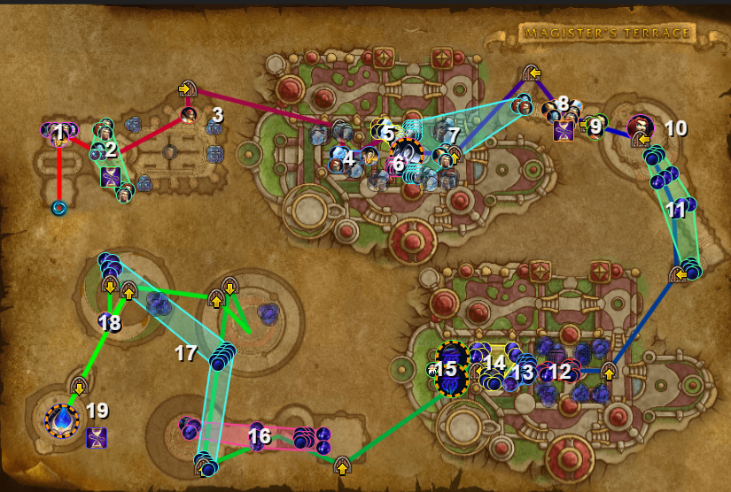
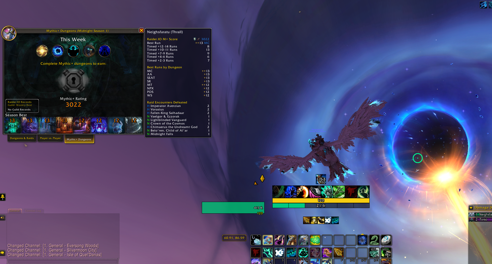

Is this a safe space? I haven't uploaded a "blog" many, many weeks. Not to say I didn't do anything in those weeks but I was not building. Creating. Learning. I was clocking in to my 9 to 5 and then from 5 to 9 playing two time sucking video games. **World of Warcraft** and **League of Legends**. If there is a medical emergency on a plane no one is going to ask "is anyone here Emerald in League??" but I might as well put onto paper what my after work brain power has been being used for.

## The Climb to Emerald

### The Motivation
Two of my best friends once told me years ago that it was very extremely not likely that I could get to Gold in League of Legends playing the ADC (attack damage carry) role. They said the role sucks and to successfully do it I would have to play a different role. That's when it became my life's mission to prove them wrong. And I eventually did it, but League has a way of sucking you in and never letting go, so *Gold* wasn't enough. I wanted *Platinum*.

I got Platinum two years ago but then I got stuck. It was no longer enough to just play the game without distractions, do some light note taking of my mistakes, and farm 8 CS per minute. So this year I set a goal of hitting Diamond. While Diamond is still far off, I did end up hitting Emerald.

### What Made The Difference
I distilled some points that made a difference for me to get to Emerald:
- Respect your opponent, y'all are in the same rank
    - At the same time, the opponent isn't a god. Don't lose confidence in yourself and your abilities. You're a worthy opponent yourself
- A good game is not a win or a loss, but one where you performed well based on simple criteria you set for yourself before the game
    - You played well but you lost? Well continue playing (objectively) well and you will win next time
- Play around your Jungler and Support
    - Your support playing safe and not listening to your pings to go in? Play safe and farm, don't run it down
    - Your Jungler wants to clear their jungle before making a play. Don't fight and then question mark ping them like they were supposed to be there
- Play to your champions strengths and weaknesses (like really understand your champs kit)
    - Sounds simple but as you start getting to higher ranks, simply hitting people as a marksman starts to not be enough
    - Two examples that massively improved my gameplay
	    - Improving my Jinx trap placement and not wasting them (they have a 17 second cooldown at level 3) won me many GAMES, not just fights
	    - Using my Kai'sa ult more conservatively (I would rather use flash than Kai'sa ult sometimes)
 
The journey to Diamond is still in it's infancy (especially since I'll be taking breaks to live life and lock in on more important things) but I'm overall happy that I'm doing the most important thing which is **I'm having FUN**

## Understanding A 20 Year Old Game

One of my friends (who I'm pretty sure was there when the dinosaurs went extinct) had been *constantly* trying to get me to play World of Warcraft for years. And it's not that I didn't think I would like it. But I'm a __bandwagon__ gamer. If a bunch of my friends start playing a game then I'm all in. But none of my friends but this one friend played WoW so I didn't feel any desire to play it. Until a couple of months ago.

Once my friends organized a guild and 9 of my friends started playing, I was locked in. I began leveling my undead monk **_Neighsfaratu_** as a Windwalker (dps) with the intention of flexing as a Brewmaster (tank) for raid.

### When This Game Got Addicting
In WoW, the sauce of the game is in the endgame. This begins when you hit max level (level 90 for the current WoW expansion). Here is when you start doing dungeons and raids (and other stuff that isn't the most interesting tbh) to level up your gear and do more dmg/be more tanky/do more heals. More importantly though, here is when the game starts getting _difficult_. In order to do higher and higher levels of content you actually have to start learning mechanics, being intentional with your skill rotations and understanding how to carry your end of a fight.

I originally leveled to 90 as a DPS character, but for raid (content where you get 10+ people to fight together against bosses) I switched to being one of the two tanks in the raid. This is when I ***locked in***. As a new player, tanking/healing in WoW is difficult because you can't be ignorant of as many things in a dungeon or raid as you can be when DPSing. If you don't do your job well enough, everyone dies and it's all (mostly) your fault. This peaked my interest immensely.

### Learning To Tank
As a noob tank I needed to learn a couple of things:
- How does my character mitigate damage?
- How do I get mobs to focus me instead of my dps and healers?
- How do I determine how many and which mobs to aggro?

As a Brewmaster monk, I mitigate my damage with `stagger`. Rather than taking damage all at once, I instead spread the damage over time as `stagger` and then use certain abilities to remove this `stagger` so I don't end up taking all of that damage eventually.

As a tank, I utilize `threat` to get mobs to target me instead of the rest of my group. I need to have more `threat` on a mob than any individual in my group, which as a Brewmaster monk I do in two ways:
1. Using `Provoke` which `taunts` a target, making them go towards me
2. Using `Provoke` on my `Black Ox Statue` which `taunts` mobs in a radius
Once mobs are taunted, they generate multiple times the regular amount of threat when I damage them, ensuring they stick on me and don't start attacking my group members.

After I figured out how to be tanky, I was left with the hardest part of tanking: figuring out what to tank. In raids, this was trivial because there are just big bad bosses and I just need to learn their mechanics. But dungeons is where this gets hard.

### Dungeons, Dungeons, and More Dungeons
In WoW dungeons, the two main objectives are: 1. kill mobs (adds) and 2. kill the bosses. You have to kill every boss listed in the dungeon's objectives and in Mythic+ dungeons (more on what that is that later) you have to kill enough mobs to fill 100% of the "enemy forces" bar. 

Other than tanking enemies, the tanks most important role is leading the group through the dungeon to the bosses in the most efficient way possible. In regular/Heroic/M0 dungeons you can kinda just run to each boss, maybe kill some mobs that get in the way. But like I mentioned above, in Mythic+ dungeons you need to kill enough mobs to fill up the bar. Every mob has a percentage number, but the percentage of all the mobs in the dungeons added up is more than 100%, so you don't need to kill every mob to get 100%. If we go over 100%, we've wasted time dealing damage to mobs we didn't need to which can have consequences in high difficulty dungeons.

A tank also has to balance how many mobs to aggro at once. Too little and you're wasting precious time and the damage dealers long cooldown spells. Too much and you'll probably die, also wasting time. This culminates in the tank needing to run a route that gets the enemy forces bar to exactlyish 100%, without pulling too many mobs and dying, all in a timely manner.

Here is an example of "Mythic Dungeon Tools" which helps with planning routes and determining which packs of mobs will get us to 100% in the most efficient manner.

### One Bird With 8 (Key)stones

Now Daniel, why do we need to do any of this in a timely manner? Well to upgrade our Mythic Keystone of course. In a season of WoW, there are 8 dungeons you can do that count towards gearing/progression of the endgame. The difficulty of these dungeons is as follows:

1. Normal
2. Heroic
3. Mythic (M0)
4. Mythic+ (M+)

Normal and Heroic are leveling difficulties, M0 is the baseline endgame difficulty, and M+ is "sky's the limit" endgame difficulties. At the beginning of each M+ dungeon, there is a thingy (idk what it's called) where you can place a ***Mythic Keystone***, whose level determines the difficulty of the dungeon. This keystone (or what we call "keys") starts at level 2 and is leveled up when you complete the dungeon at or under a specified time (typically aounrd 30 minutes). If you don't complete the dungeon in that specified time, the key you inserted goes down a level.

You see how being efficient in the dungeon matters? As your key gets to a higher and higher level, mobs and bosses become more difficult to kill, thus taking more time. The more time you take on mobs and bosses, the closer you get to going over time and "bricking" you key. But why even level up your key in the first place? Well for starters, higher keys means better loot. But for me personally, I was chasing the the Mythic+ dungeon rating. Your best run in each of the 8 dungeons in a season gives you a rating, all of which are added up to give you an overall M+ rating. The higher your number, the higher keys you'll get accepted into (i.e. when looking for a group for a dungeon, the group leader will use your rating to determine whether or not to accept you into the group).

The rating I wanted to get was ***3000**. At this rating you get a cool ass riding mount and get to flex to your friends who haven't gotten it. A rating of 3000 means you have to time 4 Level 13 keys and 4 Level 12 keys, which is NOT a trivial task. Having started playing this game "seriously" only a few months ago, I ***grinded*** learning dungeon routes, boss mechanics, and how to play my character's class well. After a couple of weeks of locking in, I finally broke the 3000 rating barrier and got my pretty white bird.

## Life After LoL and WoW

As fun as playing video games is, it's not the most productive use of my time. I'm blessed to be able to spend my 5 to 9 having fun, but I'm getting a mad itch to build something. To sink my time into projects that might crash and burn. It's morbin time.